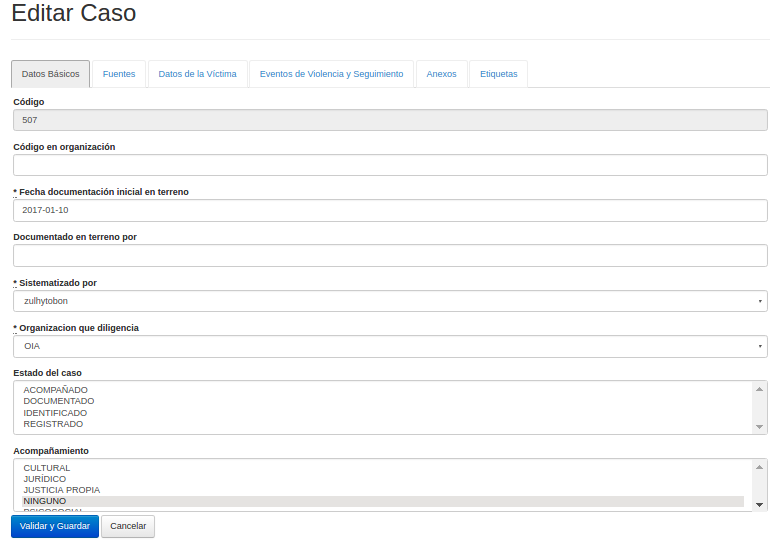
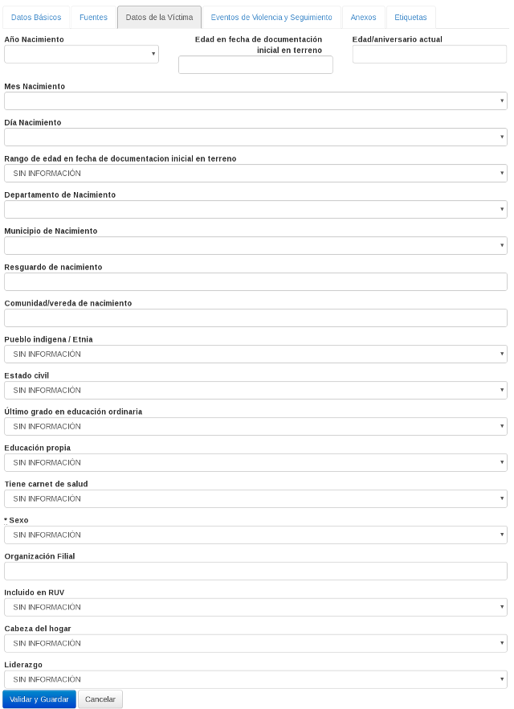

## Ingreso de nuevos casos y actualización  {#ingreso_de_nuevos_casos_y_actualizacion}
 
### Ficha Común  {#ficha_comun}

En este sistema de información un caso se asocia a una  víctima que acude a 
alguna de las organizaciones del  Observatorio de violencias contra las mujeres 
indígenas formado por las organizaciones CODACOP, ONIC, OIK y ACIN, esta víctima 
puede haber sido agredida en una o en varias oportunidades o haber recibido ayudas de 
CODACOP, ONIC, OIK o ACIN  en diferentes momentos, pero sigue siendo un mismo caso 
y todo el historial de apoyos y seguimientos institucionales y del Observatorio de 
violencias contra las mujeres indígenas se registran en el mismo.

Por esto antes de ingresar un nuevo caso es recomendable que búsque si ya está 
registrado por ejemplo utilizando el listado de casos empleando el codigo, la
fecha de documentación (o parte de la misma), el lugar en el que ocurrió, el
analista que documentó o la organización.

Si está seguro que se trata de un caso nuevo, desde el listado de casos presione 
el botón Nuevo. Comience a digitar la información en cada una de las pestañas 
del formulario --notará que el número de caso será asignado automáticamente[^ingresos.1].

El sistema guarda con sólo cambiar de pestaña y finalmente oprimiendo el botón 
Guardar.  Aunque se sugiere llenar los datos del caso en el orden de las pestañas, 
podrá pasar de una pestaña a otra e iniciar en la que prefiera. Esto por ejemplo 
es útil para iniciar un caso del que acaba de recibir información digital pero 
que no puede analizar en detalle en el momento, pues para crear un caso mínimo 
basta la fecha de documentación.
Así que si no desea que se actualicen los cambios del caso que edita, no presione el 
botón Guardar, sino devuelvase usando el botón del navegador o ubiquese en el 
espacio con la dirección de la página (URL), digite la dirección 
<https://defensor.info/mujeresindigenas/sivel2> y presione ENTER.
Con SIVeL2 puede editar diversos casos simultanemaente abriendo varias ventanas o
varias pestaña de su navegador.

La interfaz debe mejorarse continuamente, pero se diseñó con el principio 
"primero movil," por lo que resulta posible llenar un caso desde un teléfono 
inteligente con poco ancho de pantalla.  En estos casos es mejor que primero seleccione
Administrar->Ficha Vertical con lo que el formulario se presentará con
secciones colapsables verticales en lugar de pestañas horizontales, como esa
ficha vertical es un diseño adaptativo[4] se ajusta 
automáticamente a tabletas de diferentes dimensiones --puede probarlo desde una 
computador de escritorio al cambiar el tamaño de la ventana del navegador para ver 
como se reorganizan los menús, se escala la imágen de la pantalla inicial y en 
general puede llenar un caso.

#### Datos Básicos {#datos_basicos}

Entre los datos básicos de un caso es indispensable la fecha de documentación 
inicial del hecho. Si desconoce o no requiere especificar otros, en esta y en 
otras pestañas déjelos en blanco o en cuadros de selección en la opción 
SIN INFORMACIÓN.

* Código: Es asignado automáticamente por el sistema.

* Código en organización: Es el número de orden interno de cada organización.

* Administrador y Organización que diligencia no pueden ser modificados por 
usuarios con rol de analista.

* Fecha de documentación inicial en terreno:  Sera la fecha de referencia para los datos 
biográficos de la víctima (como edad, discapacidades, etc).  Si no se conoce
con precisión el día se recomienda dejar 15 y agregar etiqueta DIA_INEXACTO.
Si no se conoce el mes se recomienda dejar Junio y la etiqueta MES_INEXACTO.

* Documentado en terreno por

* Sistematizado por

* Estado del caso: acompañado, documentacdo, o registrado.    

* Acompañamiento: cultural, juridico, justicia propia,ninguno psicosocial.

### Fuentes (#fuentes)

* Fuente: familiar, medio de comunicación, otra persona, otro, remisión de otro
  cabildo, remisión institucional, víctima.

* Fecha:

* Detalle Otra Fuente:

#### Datos de la Víctima {#datos_de_la_victima}

Se trata de los datos de la persona que ha sido agredida.

* La mayoría de cuadros de selección pueden configurarse en tablas básicas 
(ver  [xref](#tablas_basicas)) típicamente con el mismo nombre: Rango de Edad, 
Pueblo indígena, Estado civil, Último grado en educación ordinaria.
* Año de nacimiento: Al elegir el año de nacimiento, automáticamente se genera la 
  edad de documentacion y aniversario.
* Edad en fecha de documentación inicial e terreno
* Edad/aniversario actual
* Rango de edad: Debe ser acorde con la edad (a menos que no se haya especificado 
edad). Si especificó la edad, puede dejar esta casilla SIN INFORMACIÓN.
* Cada sitio geográfico se específica de acuerdo a la división político 
administrativa de Colombia DIVIPOLA.
* Si entre las opciones que se le presentan no está el que busca puede agregar el 
departamento, municipio o centro poblado en la tabla básica correspondiente (ver 
[xref](#tablas_basicas)).
* Departamento: El país es Colombia y se puede elegir uno de sus departamentos 
(mientras esta información se haya especificado en las respectivas tablas básicas).
* Municipio: Una vez elija el departamento puede elegirse entre sus municipios.
* Centro Poblado: Una vez llene el municipio, aparecen posibles centros poblados 
y sitios de un municipio de acuerdo a la División Político Administrativa.
* Resguardo 
* Comunidad/Vereda
* Pueblo indigena / Etnia
* Estado civil
* Último grado en educación ordinaria
* Educación propia
* Tiene carnet de salud
* Sexo
* Organización Filial
* Incluido en RUV: Registro único de víctimas
* Cabeza del hogar
* Liderazgo

#### Eventos de violencia y seguimiento {#eventos_de_violencia_y_seguimiento}
* Se pueden agregar varios eventos y el uno queda debajo del otro pulsando el boton añadir evento y después de creado si queremos borrarlo podemos pulsar eliminar evento.
* Fecha del seguimiento
* Año del hecho
* Mes del hecho
* Día del hecho
* Día de la semana
* Departamento
* Municipio
* Resguardo
* Comunidad/vereda
* Numero de veces: Cuantas veces fue agredida la víctima antes. Se puede referenciar en números 
  o en letras.
* Relacionado con conflicto: Armado, sin información y social.
* Grupo Presunto Responsable: Permite elegir uno de los configurados en la tabla básica 
  Presuntos Responsables (ver [xref](#tablas_basicas)) ---que incluye SIN INFORMACIÓN 
  como posible opción. Un presunto responsable puede ser autor de varias agresiones, a una misma víctima, en un mismo       evento, y empezamos por añadir presunto responsable luego podemos escoger un hecho victimizante y luego otro  asi    sucesivamente y puede agregar todos los hechos que sea necesario y si se necesita borrar se borra con la x que está al lado   derecho  o con el botón eliminar. 
* Hecho Victimizante:
* Testigo 
* Tipo de afectación: comunitaria, cultural, económica, familiar, fisica, individuual, otra, psicosocial y sin información. 
* Tipo de apoyo: Comunitario, familiar, institución estatal, Ong, organización índigena, otro, sin informacón.
* Acompañamiento que necesita: Cultural, jurídico, justicia propia, ninguno, sin información.
* Situación de riesgo: no, si, sin información.
* Ante quien ha solicitado medidas: Cabildo, estado, estado y cabildo, ninguno, sin información.
* Medidas recibidas 
* Denuncia: no, si, sin información.
* ¿Denuncia ante quien?: Ambos sistemas, ordinaria, propia, sin información.
* Año denuncia
* Mes denuncia 
* Día denuncia
* Motivo para no denunciar: desconocimiento de donde denunciar, falta de credibiidad en autoridad indígena, 
  falta de credibiidad en entidades estatales, miedo a posibles retaeaciones, no considera quel los hechos son
  violación a sus derechos, otro, prevenir habladuria, sin información, vergüenza
* Valoración de la atención en materia de justicia: sin información, buena, regular, mala.
* ¿Quisiera denunciar?: no, si, sin información.

#### Anexos {#anexos}

Permite anexar archivos. Si se configuró correctamente los archivos quedan 
almacenados en una partición cifrada. Para bajar un articulo de prensa en internet,
se guarda en el PC en formato PDF y luego se anexa.
* Fecha:La fecha del archivoe
* Descripcion
* Archivo: Da la opción de descargar el archivo. 
#### Etiquetas {#etiquetas}

 
 
 Permite poner etiquetas con comentarios al caso. Note que debe elegir una de las 
etiquetas (las cuales se especifican en la tabla básica Etiqueta), opcionalmente 
poner un comentario. Es posible cambiar los comentarios --por ejemplo si se emplean 
etiquetas para marcar casos que deben revisarse, una vez revisados debe quitarse o 
cambiarse el comentario.
* Fecha:
* Usuario: Se refiere al sistematizador.
* Observaciones: Se puede hacer una descripción del porque es importante esta etiqueta,
   para este caso.
* Etiqueta: Permite hacer énfasis en algo que queremos tener en cuenta especialmente, 
  y también se puede utilizar para hacer conteos.
[^ingresos.1] La numeración es consecutiva --con saltos cuando se borran casos o se 
insertan en lote de otro SIVeL. Para efectos de conteos es mejor emplear el 
listado de casos (ver Sección 2, “Listado de Casos”) o las funcionalidades de conteos.

[^ingresos.2] En inglés responsive, traducción sugerida en 
http://words.carlus.cat/como-podemos-traducir-responsive-web-design/.

### Datos privados Acin {#datos_privados_acin}

#### Datos básicos {#datos_básicos}
* Consentimiento

#### Datos de la víctima
* Nombres y Apellidos: Se recomienda escribirlos en mayúsculas y con tildes como 
  aparecen en el documento de identificación principal.
* Tipo de documento de identidad:  Especifique el tipo y el número. Algunos tipos 
  de documentos no se especifican con un número, sino por ejemplo también con letras. 
  En el momento los documentos provisionales deben constar de una letra mayúscula 
  seguida de un guion y un número, mientras que los pasaportes de una letra seguida 
  de un número. El tipo de documento Otros permite letras y números arbitrariamente.
* Hijos: Cantidad
* Idioma: El principal

#### Evento de violencia y seguimiento {#evento_de_violencia_y_seguimiento}
* Relación entre presunto responsable y víctima
* Afectación individual
* Afectación familiar
* Afectacion física* 
* Actividades que se dejaron de hacer: Se refiere a la actividad que desempeñaba la víctima en el 
  momento de la agresión.
* Reacción de la familia yla comunidad
* Afectación a otra persona
* Avances del caso
* Etapas del proceso
* ¿Ha recibido reparación?
* Compromisos adquiridos ¿Cuales y con quien?
* Observaciones generales

### Datos privados OIK {#datos_privados_oik}

#### Evento de violencia y seguimiento {#evento_de_violencia_y_seguimiento}
* Seguimiento jurídico
* Seguimiento psicosocial y cultural

