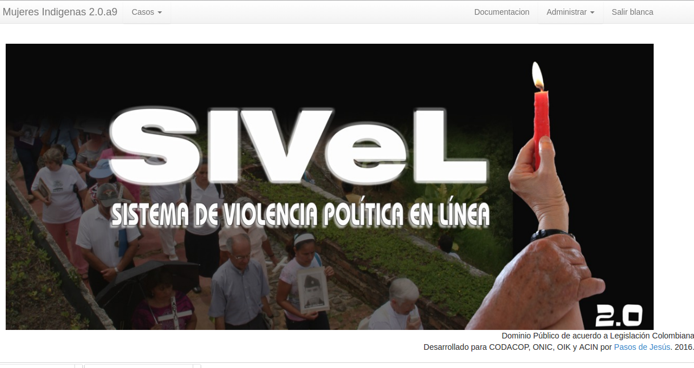

# Uso  {#uso}

**Logros**

* Puede iniciar una sesión y distinguir posibilidad de uso según el rol y según la 
organización.

* Puede buscar casos por código y examinarlo.

* Puede actualizar información de un caso o agregar casos nuevos

* Puede eliminar un caso

SIVeL2 es una aplicación web por lo que se usa con un navegador que soporte 
Javascript. En el momento de este escrito, por economía, seguridad y velocidad 
sugerimos [Chromium](https://www.google.com/chrome/browser/desktop/index.html). 
En cuanto a sistema operativo, como los virus evidencian potenciales huecos de 
seguridad que pueden hacer perder los esfuerzos de seguridad de SIVeL2, 
recomendamos emplearlo desde computadores con OpenBSD/adJ o en su defecto Linux.

Hemos procurado que la operación de SIVeL2 sea simple, basta que tenga en cuenta 
generalidades de la interacción con su navegador por ejemplo si emplea los recomendados:

* Los cuadros de selección única son desplegables y sólo permiten elegir una opción.
 

* Los cuadros de selección múltiple permiten seleccionar/deseleccionar varias 
opciones. Para hacerlo presione la tecla **Control** mientras pulsa el botón 
izquierdo del ratón.

* En cuadros de selección podrá comenzar a escribir la palabra con la que comienza 
la opción que desea elegir.

### Inicio de una sesión y autenticación {#inicio_de_una_sesion_y_autenticacion}

Desde un computador seguro (preferiblemente con OpenBSD o Ubuntu) ingrese a su 
navegador y en la barra de direcciones digite: 
<https://defensor.info/mujeresindigenas/sivel2/>

	
**Aviso**

* Note que el URL comienza con *https* es decir se transmite información del servidor 
a su computador con el protocolo del web típico (HTTP) pero con cifrado fuerte SSL. 
Este cifrado requiere que el servidor web tenga un certificado, como empleamos un 
certificado autofirmado, su navegador reportará la situación como problemática, 
aún cuando no lo es.

Para iniciar una sesión debe ingresar su nombre de usuario y su clave (que debió 
ser creada por un usuario con rol administrador).

	
**Aviso**

* SIVeL2 no almacena su clave directamente sino una especie de huella digital de la 
misma (condensado bcrypt). Por esto puede emplear la clave que prefiera con la 
confianza que no podrá ser conocida por administradores que tengan acceso a la base. 
Se recomienda que tenga números, letras y caracteres especiales. 
Es conveniente cambiarla periódicamente, puede hacerlo desde Administración->Clave.

Una vez autenticado verá el menú principal.

Dependiendo del rol de su usuario (ver Sección 2, “Recurso Humano”) tendrá o no 
tendrá acceso a las opciones del menú: Por ejemplo una persona con rol analista no 
tendrá acceso al menú Administración->Usuarios. --que si puede ser usado por
quien tenga rol administrador o administrador de oficina.

Los usuarios ACIN veran un menú más amplio que las otras organizaciones. 

